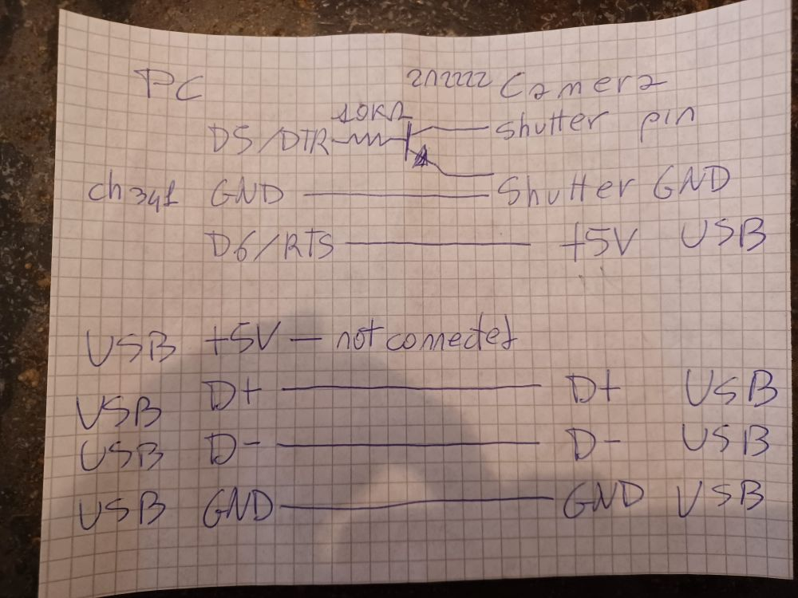
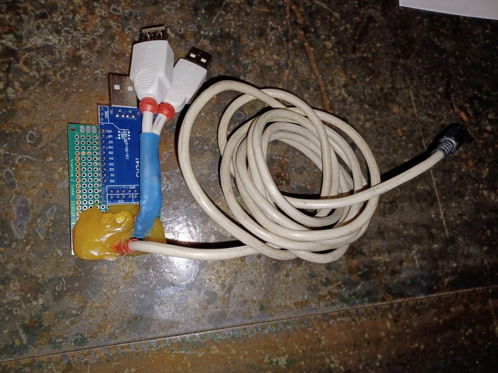
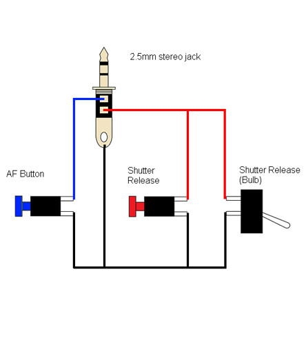

# pentaxK7Shutter

## A pentax K7 ibrid shutter that resolve pktriggercord-cli issues

### I created this project because some issues found with pktriggercord-cli with my Pentax K7.
### When i use the pktriggercord-cli program to donload and delete images from memory sometimes it hang the camera, and sometimes insert strange colors in downloaded files.
### Other commands do not create problems.
### So I decidet to use an hibryd system, that setup camera parameters with pktriggercord-cli, but take the picture with the wired remote shutter to the SD, then download the images from the camera usb drive, not using pktriggercord-cli.
### To do so, I need an automatic way to disconnect and disconnect usb from K7 to PC.

## I used usb to serial converter ch341 pin RTS connected to the usb +5V of the camera.
### Putting it at HIGH / +5V the camera is connected to PC as usb drive.
### Putting it at LOW / GND set the camera in normal state.
## I connected also the DTR pin to a resistor and a 2N2222 transistor conneted to the remote shutter connector.
### Putting it at HIGH / 5V take the picture.
### Putting it LOW / GND set the camera in normal state.

## Usage

1) Connect the camera withto the circuit with USB and shutter connector.
2) Connect the circuit to two USB port, one for CH341 serial to usb adapter, the other for the camera.
3) Set RTS to high and DTR to low, camera connected in USB mode.
4) Use the pktriggercord-cli to set the camera, shoting mode, iso, aperture, speed, focus, etc..
5) Set RTS to low, set the camera in normal take picture mode.
6) Set DTR to high for 0.5 second and take the picture
7) Set RTS high, set the camera to usb mode.
8) Download the pictute from the camera connected as mass storage.

## Schematic

The +5V USB camera input that must be connected to the RTS pin is red color. 

## The shutter

## Shutter circuit

